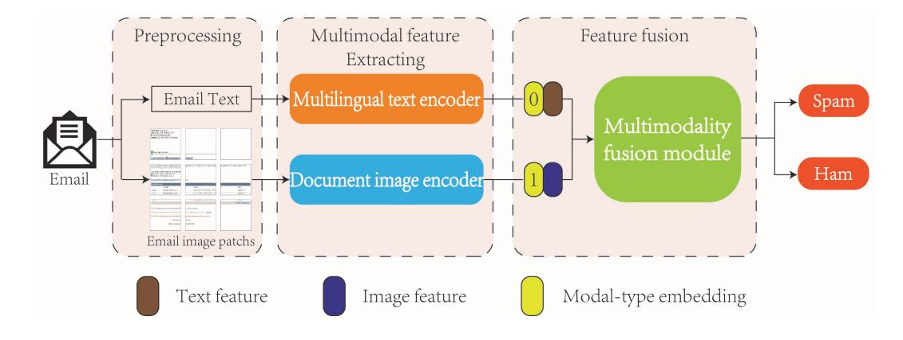
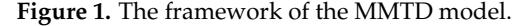
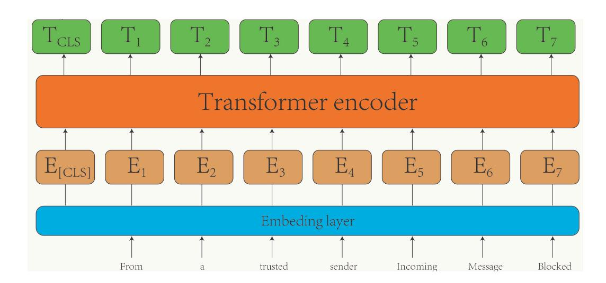
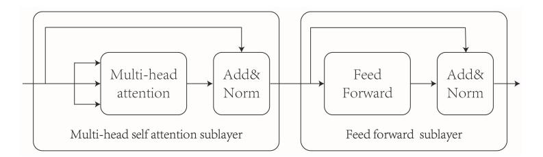
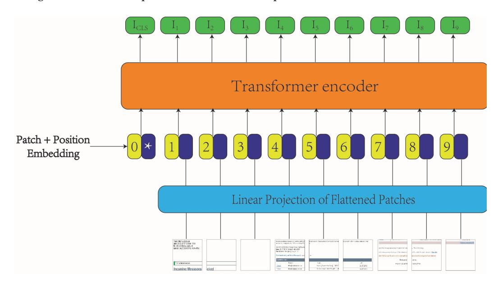
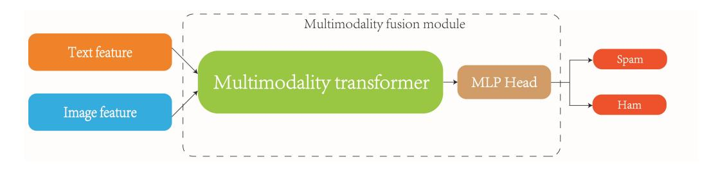
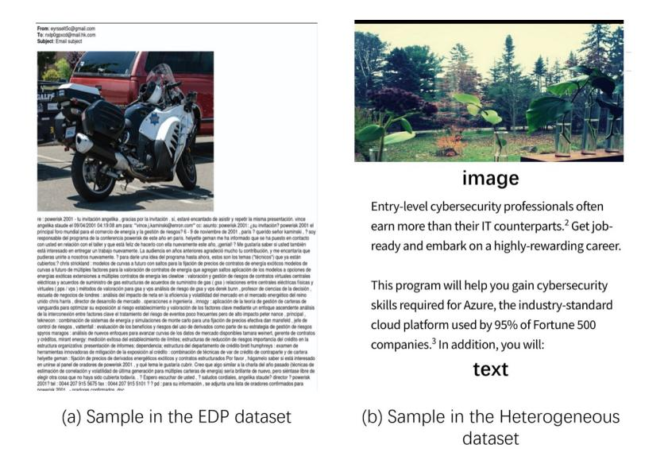
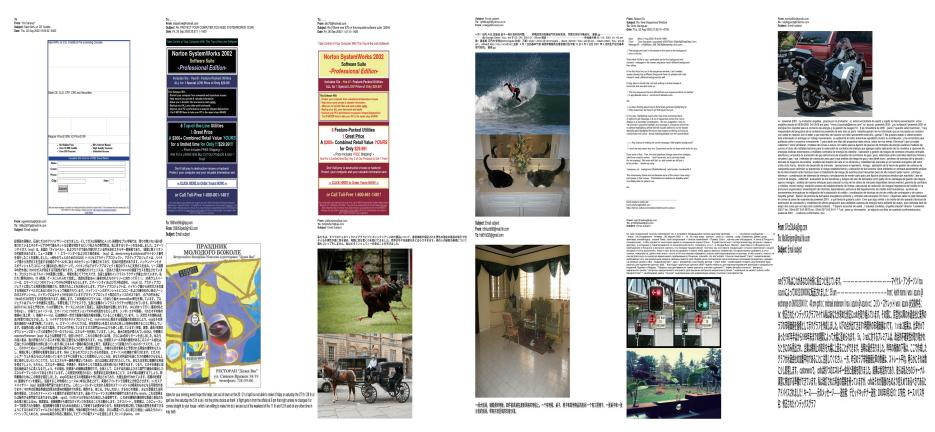
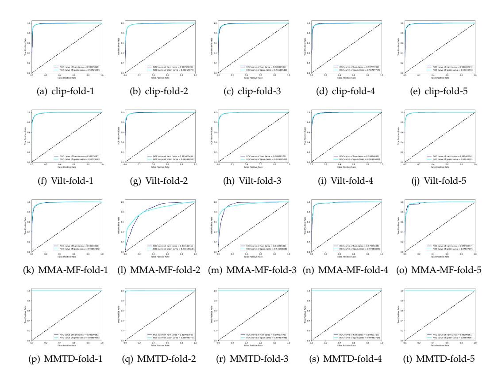
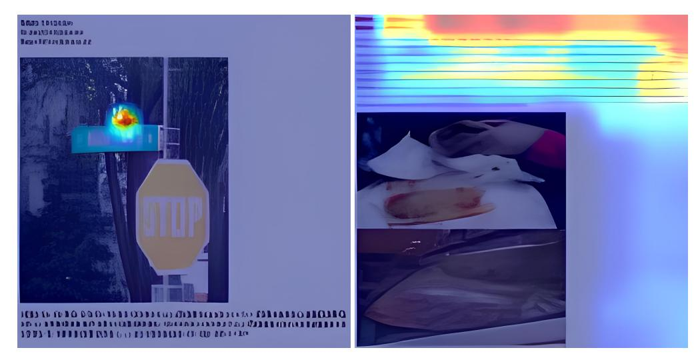

# *Article* **MMTD: A Multilingual and Multimodal Spam Detection Model Combining Text and Document Images**

**Ziqi Zhang 1 , Zhaohong Deng 1,\* [,](https://orcid.org/0000-0002-0790-6492) Wei Zhang 1 and Lingchao Bu 2**

- 1 The School of Artificial Intelligence and Computer Science, Jiangnan University, Wuxi 214122, China; 7233115021@stu.jiangnan.edu.cn (Z.Z.); 7201607004@stu.jiangnan.edu.cn (W.Z.)
- 2 The Tianjin R & D Center, Beijing Eyou Information Technology Co., Ltd., Beijing 100023, China; lingchaobu@eyou.net
- **\*** Correspondence: dengzhaohong@jiangnan.edu.cn

**Abstract:** Spam detection has been a topic of extensive research; however, there has been limited focus on multimodal spam detection. In this study, we introduce a novel approach for multilingual multimodal spam detection, presenting the Multilingual and Multimodal Spam Detection Model combining Text and Document Images (MMTD). Unlike previous methods, our proposed model incorporates a document image encoder to extract image features from the entire email, providing a holistic understanding of both textual and visual content through a single image. Additionally, we employ a multilingual text encoder to extract textual features, enabling our model to process multilingual text content found in emails. To fuse the multimodal features, we employ a multimodal fusion module. Addressing the challenge of scarce large multilingual multimodal spam datasets, we introduce a new multilingual multimodal spam detection dataset comprising over 30,000 samples, which stands as the largest dataset of its kind to date. This dataset facilitates a rigorous evaluation of our proposed method. Extensive experiments were conducted on this dataset, and the performance of our model was validated using a five-fold cross-validation approach. The experimental results demonstrate the superiority of our approach, with our model achieving state-of-the-art performance, boasting an accuracy of 99.8% when compared to other advanced methods in the field.

**Keywords:** multimodal; multilingual; spam detection; document images; multimodal feature fusion; multilingual multimodal spam dataset

# **1. Introduction**

Spam, defined as unsolicited mail sent to a large number of recipients, has become a significant challenge with the growth of the Internet. Developing an intelligent model for spam-filtering holds practical importance. Over the years, several effective methods have emerged for spam detection, primarily categorized as text-based and image-based approaches.

Text-based methods extract textual information to identify spam. For instance, previous studies [\[1](#page-19-0)[–3\]](#page-19-1) have proposed rule-based models, decision trees, and swarm algorithms combined with logistic regression for text-based spam detection.

Image-based methods, on the other hand, leverage image information to detect spam. Approaches such as probabilistic enhancement trees [\[4\]](#page-19-2), convolutional neural networks (CNNs) [\[5\]](#page-19-3), and linear support vector machines (SVMs) [\[6\]](#page-19-4) have been employed for imagebased spam filtering.

However, existing methods face a crucial challenge: they can only handle plain text or single images within emails. With the rise of media technology, the prevalence of multimodal spam containing mixed text and images has increased. Consequently, there is a need for an effective method capable of detecting such mixed-text-and-image spam.

In response, multimodal spam detection methods have been proposed in recent years. These methods extract features from both text and images and combine them

**Citation:** Zhang, Z.; Deng, Z.; Zhang, W.; Bu, L. MMTD: A Multilingual and Multimodal Spam Detection Model Combining Text and Document Images. *Appl. Sci.* **2023**, *13*, 11783. [https://doi.org/10.3390/](https://doi.org/10.3390/app132111783) [app132111783](https://doi.org/10.3390/app132111783)

Academic Editor: Agostino Forestiero

Received: 28 September 2023 Revised: 14 October 2023 Accepted: 23 October 2023 Published: 27 October 2023

**Copyright:** © 2023 by the authors. Licensee MDPI, Basel, Switzerland. This article is an open access article distributed under the terms and conditions of the Creative Commons Attribution (CC BY) license [\(https://](https://creativecommons.org/licenses/by/4.0/) [creativecommons.org/licenses/by/](https://creativecommons.org/licenses/by/4.0/) 4.0/).

for classification. For example, a multimodal spam detection model called multimodal architecture based on model fusion (MMA-MF) was introduced by Yang et al. [\[7\]](#page-19-5). This model employed long short-term memory (LSTM) and CNNs to extract text and image classification probabilities. Another model named MMPC-RF [\[8\]](#page-19-6) utilized the paragraph vector distributed bag of words (PV-DBOW) model in combination with CNNs to detect multimodal spam. These models have shown improved performance compared to singlemodal approaches.

## *1.1. Research Objectives*

Despite the effectiveness of existing single-modal and multimodal methods, they still face several challenges. The primary objectives of this study are to address the following challenges in the multimodal spam detection field:

- 1. Most existing text-based and multimodal-based spam models focus on classifying spam in a single language, with limited capability to detect spam in languages other than English. In real-world application scenarios, there is a need for models that can effectively detect spam in multiple languages.
- 2. Address the limitations of existing multimodal spam detection models by considering emails with multiple images. Most current models assume the presence of a single image in an email and fail to account for cases where an email contains multiple images. Specifically, existing models typically take input in the form of text and a single image, leading to certain disregard for additional images within the email. This limitation significantly reduces the effectiveness of the model.
- 3. Introduce the email document picture (EDP) dataset to address the scarcity of largescale multilingual multimodal spam datasets. Existing multilingual multimodal spam datasets are relatively small, containing only a few thousand email samples. Such datasets fail to adequately demonstrate the performance and practical effectiveness of spam detection models in real-world applications. The EDP dataset overcomes this limitation by providing a substantial number of samples, including emails in multiple languages and diverse combinations of images and text.

By achieving these research objectives, this study aims to advance the field of multimodal spam detection by proposing an effective model that can handle multilingual and multimodal spam, addressing the limitations of existing models, and providing a comprehensive dataset for rigorous evaluation and benchmarking of spam detection methods.

#### *1.2. Contributions*

To address these challenges, this paper presents a novel multimodal spam detection model. Firstly, we construct a multilingual text encoder based on BERT [\[9\]](#page-19-7), enabling our model to extract text features across different languages. Secondly, we propose a unique approach for processing email images. Our method involves converting the entire email into a document image and extracting image features using a document image encoder based on the document image transformer [\[10\]](#page-19-8). This transformation reframes the original spam detection problem into a document image recognition problem, effectively addressing the limitation of existing methods in handling only one image and the idleness of image encoders when processing plain text emails. To holistically consider both text and images in emails, we introduce a multimodal fusion module that combines text and image features, with the output of this module serving as the detection result. Unlike existing approaches in multimodal spam detection, our MMTD model excels in detecting multimodal multilingual spam. It can process eight different languages and effectively detect spam that contains multiple images. Our method not only addresses the limitations of existing multimodal spam detection methods but is also valuable in real-world application scenarios.

Additionally, this paper presents the construction of a new and extensive multilingual multimodal spam dataset. Specifically, we compile an email document picture (EDP) dataset by amalgamating a substantial amount of email data from existing spam detection datasets and our collected data. This dataset surpasses the scale of previous

datasets [\[7](#page-19-5)[,11](#page-19-9)[,12\]](#page-19-10) and encompasses the text content in eight languages. Notably, our dataset includes diverse email compositions, including text-only, image-only, and emails with multiple images. The incorporation of such cases in our dataset enables a more robust evaluation of our model's performance.

By proposing a novel multimodal spam detection model and constructing a comprehensive multilingual multimodal spam dataset, this study contributes to advancing the field of spam detection, particularly in terms of multilingual support and the effective processing of text and image-based spam.

## **2. Related Work**

This section briefly introduces previous works on spam detection, which can be classified into three categories: text-based, image-based, and multimodal spam detection. Additionally, it discusses works on document image recognition since the MMTD model we propose is a multimodal spam detection model combining text-based spam detection and document image recognition technology.

#### *2.1. Spam Detection*

Spam detection using machine learning techniques has been widely explored in the literature. Previous research in this area can be categorized into text-based spam detection, image-based spam detection, and multimodal spam detection. Text-based methods focus on analyzing the textual content of emails to determine their spam status, while image-based methods leverage image information to identify spam emails. Multimodal approaches combine both text and image features to achieve more accurate spam detection.

#### 2.1.1. Text-Based Spam Detection

Text-based spam detection using machine learning methods has gained significant attention in recent years. Various approaches have been proposed to effectively analyze the text content of emails. For instance, a spam filter based on a decision tree model was introduced by Kontsewaya et al. [\[13\]](#page-19-11). Research by Raza et al. [\[14\]](#page-19-12) demonstrated the superiority of multi-algorithm systems over single-algorithm systems for spam detection, with supervised learning outperforming unsupervised learning. Consequently, researchers have proposed methods that combine different algorithms, such as naive Bayes and Markov random field, to enhance spam detection accuracy [\[15\]](#page-19-13).

Moreover, deep learning models, including convolutional neural networks (CNN) and long short-term memory (LSTM), have been applied to text-based spam detection. For example, Yaseen et al. [\[16\]](#page-19-14) fine-tuned the BERT model specifically for spam detection and compared its performance against multiple existing spam detection methods on publicly available datasets. In the context of short messages, Ma et al. [\[17\]](#page-19-15) proposed a recurrent neural network with an additional hidden layer to capture hidden information for spam detection on platforms like Twitter and Sina Weibo. Additionally, Liu et al. [\[18\]](#page-19-16) introduced a "memory" mechanism into the transformer model to effectively detect short spam messages, employing learnable parameters as "memory" to store information aiding the model in predicting spam.

## 2.1.2. Image-Based Spam Detection

Spammers have increasingly employed image-based techniques to evade traditional text-based spam detection methods in email gateways. Researchers have proposed several models specifically designed for image spam detection. For example, Gao et al. [\[4\]](#page-19-2) introduced the Image Spam Hunter (ISH) dataset and developed a method based on the probability enhancement tree for spam detection. Building upon this work, Sharmin et al. [\[5\]](#page-19-3) proposed a spam detection model using convolutional neural networks (CNNs) and achieved improved performance on the ISH dataset. Similarly, Amir et al. [\[19\]](#page-19-17) constructed a spam detection model utilizing a distributed association memory tree. Additionally, Kim et al. [\[20\]](#page-19-18) developed a CNN-XGBoost framework for spam detection, employing data augmentation techniques to enhance the model's robustness. Notably, Makkar et al. [\[21\]](#page-19-19) considered the presence of links within images in emails, generating ranking features based on these links and training a neural network to detect image spam using these ranking features.

## 2.1.3. Multimodal Spam Detection

Multimodal spam, which incorporates both text and image content, poses a greater challenge for detection compared to plain text or image spam. Existing multimodal spam detection models often combine text-based and image-based methods for improved detection. For instance, multimodal architecture based on modal fusion (MMA-MF) [\[7\]](#page-19-5) proposed a model that inputs text into an LSTM model to obtain a classification probability and the image into a CNN model to obtain another classification probability. These probabilities are then concatenated and fed into a fully connected layer for spam detection. In contrast, MMPC-RF [\[8\]](#page-19-6) utilized the paragraph vector distributed bag of words (PV-DBOW) model and CNN to process the text and image of multimodal emails, respectively, and combined the output using a random forest classifier. Additionally, a complex probabilistic graph classification approach by Liu et al. [\[22\]](#page-19-20) tackled opinion spam detection by training a neural network with an attention mechanism to learn the multimodal embedded representations of nodes in the graph. Kraidia et al. [\[11\]](#page-19-9) introduced a multimodal spam filtering system for Multimedia Messaging Service (MMS) that combines a long short-term memory (LSTM) model and a convolutional neural network (CNN) model to filter spam MMS. Ruano-Ordás et al. [\[12\]](#page-19-10) proposed a deep multimodal decision-level fusion system called VTA-CNN-RF for multimedia spam filtering, using convolutional neural networks (CNNs) for feature extraction and selection, and random forest (RF) for classification. Kraidia et al. [\[23\]](#page-19-21) proposed a deep learning (DL) system that combines a convolutional neural network (CNN) and a long short-term memory (LSTM) model to classify heterogeneous malicious tweets.

## *2.2. Document Image Recognition*

In contrast to previous multimodal spam detection methods, our approach involves converting the entire email into an image and feeding it into a document image encoder. This section provides a brief review of document image recognition technology.

Document image recognition technology focuses on automatically reading, understanding, and analyzing documents and represents an important research direction within natural language processing and computer vision [\[24\]](#page-20-0). The document image transformer, proposed by Li et al. [\[10\]](#page-19-8), employs self-supervised pre-training and achieves excellent performance across various downstream tasks. Another approach by Jain et al. [\[25\]](#page-20-1) enhances the performance of visual-only document image classification algorithms by combining semantic information obtained through optical character recognition (OCR) with visual information from the document image. Similarly, Xu et al. [\[26\]](#page-20-2) introduced a model capable of processing multilingual document images and presented the XFUND dataset for evaluating their model's performance. Additionally, Huang et al. [\[27\]](#page-20-3) developed a document image recognition model and introduced a word-patch alignment task for pre-training, enabling the model to achieve cross-modal alignment. Notably, many existing document image recognition models rely on OCR to extract the document text, which demands significant computational resources. To address this limitation, Kim et al. [\[28\]](#page-20-4) proposed an OCR-free document understanding model that significantly reduces computation while ensuring satisfactory model performance.

## **3. The Proposed MMTD**

## *3.1. The Framework of the Proposed MMTD Model*

With the increasing complexity of email content, relying solely on text- or image-based spam detection models may lead to unreliable results. To address this issue, we propose a new multimodal spam detection model called MMTD, which integrates both text and image modalities for comprehensive spam detection. The MMTD model consists of three main components: a multilingual text encoder, a document image encoder, and a multimodal fusion module. These components work together to extract text and image features from emails and combine them for effective spam detection. The overall framework of the proposed model is illustrated in Figure [1,](#page-4-0) and the process can be summarized as follows:

- 1. Email data preprocessing: We start by preprocessing the email data. The body content of each email is converted into an image representation, which will serve as the input to the document image encoder. Additionally, the text within the email is extracted and saved as a separate text dataset. This allows us to process the text and image components of the email separately during model training.
- 2. Obtaining an optimal multilingual text encoder and document image encoder: To enhance feature extraction, we pre-train the multilingual text encoder and document image encoder. The pre-training is performed separately on the text dataset and image dataset, respectively, to optimize each encoder for their respective modality.
- 3. Extracting deep feature representations of an email text and image: The pre-trained multilingual text encoder is used to extract deep feature representations from the email text. Similarly, the document image encoder processes the email document image to obtain image features. These features capture the underlying characteristics of the text and image modalities, respectively.
- 4. Training the multimodal fusion module: In this module, we incorporate modal type embeddings into the text and image feature representations. These embeddings help distinguish between the text and image components during fusion. The text and image feature representations are then concatenated and fed into the multimodal fusion model. The output of the fusion model is subsequently passed through a fully connected layer to obtain the final spam classification result.

Next, we provide a detailed description of the multilingual text encoder (MTE), document image encoder (DIE), and multimodal fusion module.

## *3.2. Multilingual Text Encoder (MTE)*

The multilingual text encoder utilized in this study is based on the BERT-base multilingual cased pre-trained model [\[9\]](#page-19-7). BERT is a contextual model that has a strong bidirectional language modeling ability, which employs mask language modeling and next-sentence prediction during pre-training and is capable of supporting 104 languages. The tokenizer of BERT is designed to support multiple languages. It is trained on a wide range of languages and can provide contextual embeddings for text in various languages, making it versatile for multilingual tasks. The framework of the multilingual text encoder is depicted in Figure [2.](#page-5-0)

**Figure 2.** The framework of the multilingual text encoder.

Initially, the input text undergoes a conversion process where it is transformed into tokens representing each word in a sentence via the embedding layer. Subsequently, these tokens are fed into the transformer encoder, which consists of 12 transformer layers, facilitating the extraction of text feature representations. The structure of the transformer encoder, as well as the details regarding the pre-training and fine-tuning methods of the multilingual text encoder, are elucidated below.

#### 3.2.1. Transformer Encoder Structure

The Transformer encoder consists of multiple stacked transformer layers [\[29\]](#page-20-5), as illustrated in Figure [3.](#page-5-1) Each transformer layer comprises a multi-head self-attention sublayer and a feedforward network sublayer. The feedforward sublayer consists of two fully connected layers, enabling the extraction of important features. The multi-head self-attention layer incorporates several self-attention mechanisms that capture the correlation coefficients between words in a sentence across multiple dimensions, effectively capturing contextual information within the text.

**Figure 3.** Transformer layer structure.

Given an input *x*0 ∈ R*b*×*s*×*d*model , where *b* represents the batch size during training, *s* denotes the sequence length, and *d*model represents the word token dimension, the calculation procedure of a transformer layer is as follows:

$$
x_a = LayerNorm(x_0 + MultiHeadAttention(x_0)).
$$
 (1)

$$
x_1 = LayerNorm(x_a + FeedForward(x_a)).
$$
 (2)

In Equation [\(1\)](#page-5-2), *x*0 is added to the output of the multi-head self-attention sublayer, and the result is normalized using LayerNorm to obtain *xa* ∈ R*b*×*s*×*d*model .

In Equation [\(2\)](#page-5-3), *xa* is added to the output of the feedforward network sublayer, and the result is again normalized using LayerNorm to obtain the final representation *x*1 ∈ R*b*×*s*×*d*model .

The detailed calculation process of the multi-head attention mechanism is as follows:

$$
MultiHeadAttention(Q, K, V) = Concat(head_1, ..., head_h) \cdot W^O,
$$
\n(3)

$$
head_i = \text{Attention}(Q_i, K_i, V_i), \tag{4}
$$

$$
Attention(Q_i, K_i, V_i) = softmax\left(\frac{Q_i K_i^T}{\sqrt{d_k}}\right) V_i,
$$
\n(5)

where *Qi* = *x*0 · *W Q i* , *Ki* = *x*0 · *WK i* , and *Vi* = *x*0 · *WV i* are used to calculate the attention of the *i*-th head. Here, *i* = 1, 2, . . . , *h*, and *W Q i* , *WK i* , *WV i* ∈ R*d*model×*dk* represent the mapping matrices of *x*0. Each *headi* represents the attention of the *i*-th head, and the *h headi* tensors are concatenated along their third dimension *dk* . Finally, the concatenated result is multiplied by *WO* ∈ R*hdk*×*d*model in the third dimension to obtain the value of the multi-head attention.

#### 3.2.2. Multilingual Text Encoder Pre-Training

Models that are pre-trained on large amounts of data tend to achieve better performance in downstream tasks. Therefore, the text encoder in this paper undergoes pretraining using multilingual data. The pre-training process involves two tasks: mask language modeling (MLM) and next-sentence prediction (NSP). These tasks enable the model to capture comprehensive linguistic information and understand the relationships between sentences.

In the MLM task, the objective is to train the model to accurately predict masked word tokens, allowing it to capture bidirectional information within a sentence. First, the input sentence is tokenized into word tokens, and then approximately 15% of the word tokens are randomly selected for masking. For the selected tokens, there is an 80% probability of replacing a token with a special mask token, a 10% probability of replacing it with another random word token, and a 10% probability of leaving the token unchanged.

In the NSP task, the aim is to enable the model to understand the relationship between pairs of sentences. To accomplish this, a binary classification dataset is constructed from the corpus. For each sample consisting of sentence A and sentence B, if sentence B follows sentence A in the corpus, it is labeled as a positive sample; otherwise, it is labeled as a negative sample. The model is then trained for sentence pair classification based on this constructed dataset.

#### 3.2.3. Multilingual Text Encoder Fine-Tuning

In order to enhance the performance of the pre-trained multilingual text encoder on the specific downstream task of spam detection, we perform fine-tuning using the email document picture (EDP) dataset. Fine-tuning enables the multilingual text encoder to adapt and specialize its text feature extraction capabilities for the task of classifying spam. Through this process, we obtain a fine-tuned multilingual text encoder that is effective in extracting discriminative features for spam detection.

# *3.3. Document Image Encoder (DIE)*

In this paper, we present an innovative approach to email image processing. Instead of treating individual components separately, we transform the entire email into a single image, enabling the model to comprehensively analyze both textual and visual content within the email. As email images often resemble document images in structure, we employ a pre-trained model specialized in document image processing. Specifically, we utilize the document image transformer (DiT) [\[10\]](#page-19-8), which has undergone pre-training on the IIT-CDIP dataset [\[30\]](#page-20-6), consisting of 42 million document images. DiT serves as our document image encoder to extract features from email document images. In the following sections, we describe the architecture of the document image encoder (DIE) and provide details on its pre-training and fine-tuning methods.

# 3.3.1. Document Image Encoder Model Framework

The model framework for the document image encoder is depicted in Figure [4.](#page-7-0) Initially, an email image is divided into a sequence of image patches. These patches undergo linear projection, followed by the addition of position embeddings, providing input to the transformer encoder. Subsequently, the transformer encoder processes the input sequence and generates feature representations for use in spam detection.

**Figure 4.** The framework of the document image encoder.

## 3.3.2. Document Image Encoder Pre-Training

Pre-training the document image encoder is a crucial step in enhancing the performance of transformer-based models. The document image encoder undergoes pre-training using the masked image modeling (MIM) task, which involves two representational views of the image: image patches and visual tokens. These views serve as both inputs and prediction targets in the pre-training task. The MIM task trains the model to predict the visual tokens corresponding to the masked image patches. We provide a brief overview of image patches, visual tokens, and the MIM pre-training task below.

**Image patches:** Initially, the 2D image is resized to dimensions of 224 × 224 in RGB format and then divided into a sequence of image patches. This division enables the transformer to directly process image data. Specifically, the image *x* ∈ R*H*×*W*×*C* is transformed into *N* image patches *X P* ∈ R*N*×*P* 2×*C*, where *C* represents the number of channels, *N* = *HW P*2 , and (*H*, *W*) denote the size of the input image. In the document image encoder, we set (*H*, *W*), *C*, and (*P*, *P*) to (224, 224), 3, and (16, 16), respectively.

**Visual tokens:** Visual tokens are obtained through the image tokenizer, representing discrete sequences that correspond to the input image. These tokens serve as prediction targets in the MIM tasks. The image tokenizer is a discrete variational autoencoder (dVAE) trained on the IIT-CDIP dataset [\[30\]](#page-20-6).

**MIMl Pre-training task:** In the MIM pre-training task, an input image *x* is divided into *N* image patches, and the trained dVAE converts *x* into visual tokens corresponding to each image patch. Subsequently, 40% of the image patches are randomly masked, and the masked image patches are replaced with a learnable token *emask*. The model is then trained to predict the visual tokens corresponding to the masked image patches during pre-training.

### 3.3.3. Document Image Encoder Fine-Tuning

To enhance the performance of the pre-trained document image encoder for the specific downstream task of spam detection, we conducted fine-tuning on the document image encoder using the email document picture (EDP) dataset. This fine-tuning process is performed before integrating the document image encoder into the MMTD framework. Our data augmentation strategy includes random contrast and sharpness adjustments to improve the model's performance and robustness. Fine-tuning enables the document image encoder to adapt specifically for document image classification, making it more effective in spam detection.

The fusion of features from the multilingual text encoder and document image encoder is facilitated through a dedicated multimodal fusion module. This module empowers the integration of two distinct feature types for further learning and, ultimately, drives the spam detection process based on the output of the MLP head. The architectural blueprint of the multimodal fusion module is visually represented in Figure [5.](#page-8-0) The design of the multimodality transformer follows the setting of the transformer encoder layer, comprising a multi-head self-attention sublayer and a feedforward network sublayer.

**Figure 5.** The architecture of the multimodal fusion module.

## *3.4. Multimodal Fusion Module*

The text features, denoted by *T* ∈ R*b*×*s*×*d*model , are the output of the multilingual text encoder. Likewise, the image features, denoted by *I* ∈ R*b*×*s*×*d*model , are the output of the document image encoder. Both feature types share the same dimensions, where *b* signifies the batch size during training, *s* represents the sequence length, and *d*model designates the word token dimension. In our training configuration, the batch size is set to 40, sequence lengths are 256 for *T* and 197 for *I*, and the dimension *d*model is 768 for both *T* and *I*.

The training sequence of the multimodal fusion module unfolds as follows: First, we incorporate modal type embeddings into their respective feature types. Subsequently, we concatenate these two feature types along the sequence length dimension, resulting in concatenated features with dimensions of 40 × 453 × 768. Next, the concatenated features are fed into a multimodal transformer. Finally, the output of the multimodal transformer's first token is directed into the MLP head to derive the classification result. It is imperative to emphasize that, during the training of the multimodal fusion module, the parameters of the multilingual text encoder and document image encoder remain frozen, and only the multimodal fusion module is subject to training. The loss function utilized for training the MMTD model is the cross-entropy loss, as indicated in Equation [\(6\)](#page-8-1).

$$
H(y, \hat{y}) = -\frac{1}{N} \sum_{i=1}^{N} [y_i \log(\hat{y}_i) + (1 - y_i) \log(1 - \hat{y}_i)]
$$
 (6)

In Equation [\(6\)](#page-8-1), *yi* represents the true labels, while *y*ˆ*i* signifies the predicted probabilities for a set of *N* samples. This formula computes the negative average of the sum of two terms: the first term evaluates the contribution of the true positive class, whereas the second term assesses the contribution of the true negative class. The objective is to minimize this loss to enhance the accuracy of classification models.

# **4. Email Document Picture (EDP) Dataset**

The Email Document Picture (EDP) dataset has been specifically designed for the evaluation of spam detection models. While other existing email datasets, such as the Spam Assassin dataset [\(https://spamassassin.apache.org/old/publiccorpus/,](https://spamassassin.apache.org/old/publiccorpus/) accessed on 1 June 2022) and the Enron Email dataset [\(https://www.kaggle.com/datasets/wcukierski/](https://www.kaggle.com/datasets/wcukierski/enron-email-dataset) [enron-email-dataset,](https://www.kaggle.com/datasets/wcukierski/enron-email-dataset) accessed on 1 June 2022), have been used in the past, they often lack image components and have limited multimodal data. To overcome these limitations, we introduced the EDP dataset, which includes both textual and visual elements within email samples. The EDP dataset stands out for several reasons, distinguishing it from prior multimodal spam datasets:

- 1. The EDP dataset is currently the largest multilingual multimodal spam detection dataset available. While Kraidia et al. [\[23\]](#page-19-21) introduced the Heterogeneous dataset with a larger number of samples, it does not include multilingual text.
- 2. Images in the EDP dataset are unique, as they are document images converted from emails. This differs from other multimodal spam datasets where images are extracted from emails. Figure [6](#page-9-0) illustrates the distinction between these two dataset types.
- 3. The EDP dataset features varying numbers of images within each data sample. Figure [7](#page-10-0) provides sample illustrations from the EDP dataset, showcasing examples of both spam and non-spam (ham) emails.

**Figure 6.** (**a**) Displays an email document from the EDP dataset, containing both image and text components combined into a single email sample; (**b**) is a sample from the heterogeneous dataset, where the image and text components of an email are stored separately.

The EDP dataset is a synthetic compilation created by combining data from various sources. It includes a portion from the Spam Assassin dataset, another portion collected by our team, and the remaining data are synthesized. The synthesis process involves the random selection of text and image materials to construct the email samples. Text materials are sourced from repositories such as the Enron email dataset, the Spam Classification Dataset CSV [\(https://www.kaggle.com/datasets/balaka18/email](https://www.kaggle.com/datasets/balaka18/email-spam-classification-dataset-csv)[spam-classification-dataset-csv,](https://www.kaggle.com/datasets/balaka18/email-spam-classification-dataset-csv) accessed on 1 June 2022), the Multilingual Spam dataset [\(https://www.kaggle.com/datasets/rajnathpatel/multilingual-spam-data,](https://www.kaggle.com/datasets/rajnathpatel/multilingual-spam-data) accessed on 1 June 2022) and the Ling-Spam dataset [\(https://www.kaggle.com/datasets/mandygu/](https://www.kaggle.com/datasets/mandygu/lingspam-dataset) [lingspam-dataset,](https://www.kaggle.com/datasets/mandygu/lingspam-dataset) accessed on 1 June 2022). On the other hand, image materials are randomly chosen from the COCO Caption dataset [\(https://cocodataset.org/#download,](https://cocodataset.org/#download) accessed on 1 June 2022) the Image Spam Hunter dataset [\[4\]](#page-19-2), and the Dredze dataset [\(https://www.cs.jhu.edu/~mdredze/datasets/image\\_spam/](https://www.cs.jhu.edu/~mdredze/datasets/image_spam/) accessed on 1 June 2022).

(a) Spam samples (b) Ham samples

**Figure 7.** Samples in the EDP dataset.

Regarding the language of the text materials, the original Enron email dataset, Email Spam Classification Dataset CSV, Multilingual Spam dataset, and Ling-Spam dataset encompass English, French, German, and Hindi. The text content of the real email data that we collected ourselves includes English and Chinese. Moreover, Google-translated Japanese, Russian, and Spanish data were added to extend the language diversity. Consequently, the final synthetic email dataset comprises text in eight languages: English, Chinese, Japanese, Russian, Spanish, French, German, and Hindi.

Concerning the image materials, all images from the COCO Caption dataset are treated as natural images, while images from the Image Spam Hunter dataset and the Dredze dataset are deduplicated and randomly selected for inclusion in the generated emails.

The synthetic dataset encompasses email samples with various configurations, including text-only, image-only, text with one image, and text with two images. The classification of spam and ham emails in the dataset adheres to the criteria outlined in Table [1,](#page-10-1) with specific numbers of ham and spam instances detailed in Table [2.](#page-10-2)

**Table 1.** Synthetic email judgment criteria.

|           | Image Spam | Natural Image |  |
|-----------|------------|---------------|--|
| Text spam | spam       | spam          |  |
| Text ham  | spam       | ham           |  |

**Table 2.** EDP dataset.

| Class | Quantity |  |  |
|-------|----------|--|--|
| ham   | 15,872   |  |  |
| spam  | 15,340   |  |  |
| Total | 31,212   |  |  |

#### **5. Results**

*5.1. Experiment Setup*

5.1.1. Comparison Methods

In our experiments, we conducted a comparative analysis between the proposed MMTD model and three representative multimodal classification models to evaluate its effectiveness. Below are descriptions of the three comparison methods:

1. CLIP [\[31\]](#page-20-7): CLIP utilizes contrastive learning during pre-training on a large-scale dataset comprising 400 million pairs of image and text data. For our study, we utilized the text encoder and image encoder of the original CLIP model. To ensure a fair comparison, we employed the same multimodal fusion module as MMTD to combine the text and image features extracted by CLIP.

- 2. Vilt [\[32\]](#page-20-8): Vilt presents a distinct approach compared to CLIP, simplifying the process of extracting text and image features. Similar to CLIP, Vilt employs a transformer for feature fusion. However, Vilt introduces more transformer layers in the modal fusion section compared to CLIP.
- 3. MMA-MF [\[7\]](#page-19-5): This model is specifically tailored for multimodal spam detection. It uses an LSTM model to calculate the classification probability based on the text and a CNN model to calculate the classification probability based on the image. The probabilities from both modalities are concatenated and fed into a fully connected layer to obtain the final spam detection result.

By comparing MMTD's performance with these three models, we can assess its effectiveness in the realm of multimodal spam detection.

## 5.1.2. Evaluation Metrics

To evaluate the effectiveness of our proposed methods, we employed four key evaluation metrics in our experiments. These metrics include:

- Accuracy: The ratio of correctly classified instances to the total number of instances, providing an overall measure of model performance.
- Precision: The ratio of true positive predictions to the sum of true positive and false positive predictions, assessing the accuracy of positive class predictions.
- Recall: The ratio of true positive predictions to the sum of true positive and false negative predictions, measuring the model's ability to correctly identify positive instances.
- F1 Score: The harmonic mean of precision and recall, providing a balanced measure of both precision and recall.

$$
Accuracy = \frac{TP + TN}{TP + TN + FP + FN}
$$
 (7)

$$
Precision = \frac{TP}{TP + FP}
$$
\n(8)

$$
Recall = \frac{TP}{TP + FN} \tag{9}
$$

$$
F1_{score} = 2 \times \frac{Precision \times Recall}{Precision + Recall}
$$
\n(10)

The definitions of FP, FN, TP, and TN are as follows:

- 1. False positive (FP): The number of Hams that the model misclassified;
- 2. False negative (FN): The number of spams that the model misclassified;
- 3. True positive (TP): The number of spams that the model correctly classified;
- 4. True negative (TN): The number of Hams that the model correctly classified.

For robust evaluation, the performance of our proposed model was verified using the five-fold cross-validation method. In cross-validation, the EDP dataset was partitioned into five sub-datasets. In each iteration, one sub-dataset was reserved for validation, while the remaining sub-datasets were employed for training. This process was repeated five times with different validation and training sub-datasets. The model's performance was evaluated by taking the average values of accuracy, precision, recall, and F1 score across all iterations.

## *5.2. Experimental Results*

This section presents a comprehensive comparative analysis of the experimental results obtained from four distinct methods. Detailed hyperparameter configurations for these models are provided in Table [3.](#page-12-0) Notably, hyperparameter selection hinges on hardware constraints, with the GPU memory capacity influencing the choice of batch size. Furthermore, we adhered to the default settings recommended by a hugging face for learning rate scheduling, warm-up steps, and learning rate decay policies. Additionally, we meticulously determined the number of epochs based on the performance of the models on the test dataset.

| Models | Epoch | Batch Size | Optimizer | Learning Rate |
|--------|-------|------------|-----------|---------------|
| MMTD   | 3     | 40         | AdamW     | 0.0005        |
| CLIP   | 10    | 16         | AdamW     | 0.00002       |
| Vilt   | 10    | 16         | AdamW     | 0.00002       |
| MMA-MF | 15    | 32         | AdamW     | 0.001         |

Table [4](#page-13-0) shows the experimental results, Table [5](#page-13-1) shows the confusion matrix, and Figure [8](#page-13-2) shows the ROC curve of models, respectively. The larger the value of the diagonal element in the confusion matrix, the better the performance of the method. From Tables [4](#page-13-0) and [5](#page-13-1) and Figure [8,](#page-13-2) the following observations can be drawn:

- 1. Despite using the same modal fusion strategy, MMTD achieves better performance than CLIP. This suggests that the multilingual text encoder and document image encoder employed in MMTD are more effective in feature extraction for spam detection. The improved performance of MMTD indicates the significance of utilizing specialized encoders for specific tasks.
- 2. Vilt, while emphasizing feature fusion, overlooks the importance of early-stage feature extraction from text and images. As a result, MMTD outperforms Vilt in terms of performance. This highlights the advantage of MMTD's holistic approach that combines effective feature extraction with robust fusion techniques.
- 3. Compared with MMA-MF, because the LSTM text encoder used by MMA-MF cannot handle multilingual messages well, and directly using CNN as an image encoder is not very effective in distinguishing document images, its effect is worse than the other three methods.

| Model  | Fold | Accuracy | Precision | Recall | F1-Score |
|--------|------|----------|-----------|--------|----------|
|        | 1    | 0.954    | 0.950     | 0.950  | 0.950    |
|        | 2    | 0.941    | 0.940     | 0.940  | 0.940    |
|        | 3    | 0.944    | 0.940     | 0.940  | 0.940    |
| CLIP   | 4    | 0.954    | 0.950     | 0.950  | 0.950    |
|        | 5    | 0.953    | 0.950     | 0.950  | 0.950    |
|        | mean | 0.949    | 0.946     | 0.946  | 0.946    |
|        | 1    | 0.942    | 0.940     | 0.940  | 0.940    |
|        | 2    | 0.952    | 0.950     | 0.950  | 0.950    |
|        | 3    | 0.948    | 0.950     | 0.950  | 0.950    |
| Vilt   | 4    | 0.942    | 0.940     | 0.940  | 0.940    |
|        | 5    | 0.954    | 0.950     | 0.950  | 0.950    |
|        | mean | 0.948    | 0.946     | 0.946  | 0.946    |
|        | 1    | 0.930    | 0.930     | 0.930  | 0.930    |
|        | 2    | 0.769    | 0.770     | 0.770  | 0.770    |
|        | 3    | 0.889    | 0.890     | 0.890  | 0.890    |
| MMA-MF | 4    | 0.938    | 0.940     | 0.940  | 0.940    |
|        | 5    | 0.936    | 0.940     | 0.940  | 0.940    |
|        | mean | 0.892    | 0.894     | 0.894  | 0.894    |

**Table 4.** Experimental results.

| Model | Fold | Accuracy | Precision | Recall | F1-Score |
|-------|------|----------|-----------|--------|----------|
| MMTD  | 1    | 1.000    | 1.000     | 1.000  | 1.000    |
|       | 2    | 0.992    | 0.990     | 0.990  | 0.990    |
|       | 3    | 0.999    | 1.000     | 1.000  | 1.000    |
|       | 4    | 0.999    | 1.000     | 1.000  | 1.000    |
|       | 5    | 1.000    | 1.000     | 1.000  | 1.000    |
|       | mean | 0.998    | 0.998     | 0.998  | 0.998    |

**Table 5.** Model confusion matrix.

|             |                    | CLIP Vilt MMA-MF |                    |                     | MMTD               |                     | Fold             |                   |   |
|-------------|--------------------|------------------------|--------------------|---------------------|--------------------|---------------------|------------------|-------------------|---|
| Ham Spam | Ham 3023 139 | Spam 147 2935    | Ham 3002 195 | Spam 168 2879 | Ham 2923 187 | Spam 247 2887 | Ham 3170 3 | Spam 0 3071 | 1 |
| Ham         | 3027               | 234                    | 3141               | 120                 | 2702               | 559                 | 3227             | 34                | 2 |
| Spam        | 137                | 2844                   | 181                | 2800                | 884                | 2097                | 15               | 29,665            |   |
| Ham         | 3003               | 159                    | 3005               | 157                 | 2934               | 228                 | 3159             | 3                 | 3 |
| Spam        | 193                | 2887                   | 168                | 2912                | 466                | 2614                | 1                | 3079              |   |
| Ham         | 3016               | 118                    | 3047               | 87                  | 2859               | 275                 | 3132             | 2                 | 4 |
| Spam        | 172                | 2936                   | 275                | 2833                | 112                | 2996                | 4                | 3104              |   |
| Ham         | 3042               | 103                    | 3019               | 126                 | 2971               | 174                 | 3144             | 1                 | 5 |
| Spam        | 192                | 2905                   | 161                | 2936                | 225                | 2872                | 1                | 30,965            |   |

**Figure 8.** ROC curve of models.

# *5.3. Ablation Study*

## 5.3.1. The Effectiveness of Multilingual Text Encoder and Document Image Encoder

To assess the effectiveness of the proposed multilingual text encoder (MTE) and the document image encoder (DIE) in extracting features essential for spam detection, we conducted two single-modal spam detection comparison experiments: one using textbased features and another using image-based features. The hyperparameters were set to their best-performing values for each model, as detailed in Table [6.](#page-14-0) The results are presented in Tables [7](#page-14-1) and [8,](#page-14-2) where MTE represents the multilingual text encoder, and DIE represents the document image encoder.

In the text-based comparison experiment, we employed the MTE exclusively for classification and compared its performance with LSTM. The results, presented in Tables [7](#page-14-1) and [8,](#page-14-2) indicate that the average accuracy of MTE is 0.915, while the average accuracy of LSTM is 0.783. These findings strongly support the conclusion that our proposed multilingual text encoder is more effective than the traditional LSTM encoder in extracting text features for spam detection.

**Table 6.** Hyperparameter settings in ablation experiments.

| Encoder | Epoch | Batch Size | Optimizer | Learning Rate |
|---------|-------|------------|-----------|---------------|
| MTE     | 3     | 16         | AdamW     | 0.00005       |
| LSTM    | 40    | 32         | Adam      | 0.001         |
| DIE     | 5     | 32         | AdamW     | 0.00005       |
| CNN     | 40    | 32         | SGD       | 0.01          |

| Model | Fold | Accuracy | Precision | Recall | F1-Score |
|-------|------|----------|-----------|--------|----------|
|       | 1    | 0.914    | 0.930     | 0.910  | 0.910    |
|       | 2    | 0.915    | 0.920     | 0.910  | 0.910    |
|       | 3    | 0.913    | 0.920     | 0.910  | 0.910    |
| MTE   | 4    | 0.919    | 0.930     | 0.920  | 0.920    |
|       | 5    | 0.915    | 0.930     | 0.910  | 0.910    |
|       | mean | 0.915    | 0.926     | 0.912  | 0.912    |
|       | 1    | 0.848    | 0.850     | 0.850  | 0.850    |
|       | 2    | 0.716    | 0.740     | 0.710  | 0.700    |
| LSTM  | 3    | 0.834    | 0.840     | 0.830  | 0.830    |
|       | 4    | 0.704    | 0.740     | 0.700  | 0.690    |
|       | 5    | 0.814    | 0.830     | 0.810  | 0.810    |
|       | mean | 0.783    | 0.800     | 0.780  | 0.776    |

**Table 7.** Performance comparison of text encoders.

**Table 8.** Confusion matrix of text encoders.

|             |                    | MTE                |                    | LSTM                | Fold |
|-------------|--------------------|--------------------|--------------------|---------------------|------|
| Ham Spam | Ham 3141 506 | Spam 29 2568 | Ham 2824 606 | Spam 346 2468 | 1    |
| Ham         | 3207               | 54                 | 2898               | 363                 | 2    |
| Spam        | 478                | 2503               | 1407               | 1574                |      |
| Ham         | 3137               | 25                 | 2769               | 393                 | 3    |
| Spam        | 515                | 2565               | 644                | 2436                |      |
| Ham         | 3114               | 20                 | 2785               | 349                 | 4    |
| Spam        | 488                | 2620               | 1496               | 1612                |      |
| Ham         | 3118               | 27                 | 2855               | 290                 | 5    |
| Spam        | 502                | 2595               | 872                | 2225                |      |

Similarly, in the image-based comparison experiment, we exclusively utilized the DIE for classification and compared its performance with CNN. The results, shown in Tables [9](#page-15-0) and [10,](#page-15-1) reveal that the average accuracy of DIE is 0.930, while the average accuracy of CNN is 0.734. This outcome underscores that our document image encoder outperforms the traditional CNN encoder in extracting image features for spam detection.

| Model | Fold | Accuracy | Precision | Recall | F1-Score |
|-------|------|----------|-----------|--------|----------|
|       | 1    | 0.919    | 0.920     | 0.920  | 0.920    |
|       | 2    | 0.933    | 0.930     | 0.930  | 0.930    |
|       | 3    | 0.934    | 0.930     | 0.930  | 0.930    |
| DIE   | 4    | 0.936    | 0.940     | 0.940  | 0.940    |
|       | 5    | 0.930    | 0.930     | 0.930  | 0.930    |
|       | mean | 0.930    | 0.930     | 0.930  | 0.930    |
|       | 1    | 0.728    | 0.750     | 0.730  | 0.720    |
|       | 2    | 0.748    | 0.760     | 0.740  | 0.740    |
|       | 3    | 0.733    | 0.750     | 0.730  | 0.730    |
| CNN   | 4    | 0.735    | 0.750     | 0.730  | 0.730    |
|       | 5    | 0.728    | 0.750     | 0.730  | 0.720    |
|       | mean | 0.734    | 0.752     | 0.732  | 0.728    |

**Table 9.** Performance comparison of image encoders.

**Table 10.** Confusion matrix of image encoders.

|             |                    | DIE                 |                     | CNN                 | Fold |
|-------------|--------------------|---------------------|---------------------|---------------------|------|
| Ham Spam | Ham 2913 250 | Spam 257 2824 | Ham 2810 1337 | Spam 360 1737 | 1    |
| Ham         | 2977               | 284                 | 2757                | 504                 | 2    |
| Spam        | 137                | 2844                | 1071                | 1910                |      |
| Ham         | 2896               | 266                 | 2784                | 378                 | 3    |
| Spam        | 144                | 2936                | 1290                | 1790                |      |
| Ham         | 2890               | 244                 | 2649                | 485                 | 4    |
| Spam        | 153                | 2955                | 1170                | 1938                |      |
| Ham         | 2827               | 318                 | 2750                | 395                 | 5    |
| Spam        | 120                | 2977                | 1300                | 1797                |      |

In addition, we employed the pytorch\_grad\_cam package to visualize regions of interest derived from the DIE, as shown in Figure [9.](#page-16-0) The visualization illustrates that the DIE primarily focuses on the text portion of a document picture, enabling it to better discern whether a document is spam.

# 5.3.2. The Effectiveness of Multimodal Fusion Module

The effectiveness of the multimodal fusion module in our method is further demonstrated by comparing the single-modality detection method with the multimodal detection method. The experimental results are presented in Table [11.](#page-16-1)

From Table [11,](#page-16-1) it is evident that our model, which combines the multilingual text encoder and the document image encoder, outperforms using only the multilingual text encoder or the document image encoder. This highlights that multimodal fusion significantly enhances the detection performance of multimodal spam.

These findings strongly support the idea that integrating information from multiple modalities, such as text and images, through the multimodal fusion module, substantially improves the overall spam detection performance.

(a) Region of interest of DIE on ham sample (b) Region of interest of DIE on spam sample

**Figure 9.** The regions of interest of DIE.

| Table 11. Performance comparison between single-mode and multimodal models. |  |  |  |
|-----------------------------------------------------------------------------|--|--|--|
|                                                                             |  |  |  |

| Model | Fold | Accuracy | Precision | Recall | F1-Score |
|-------|------|----------|-----------|--------|----------|
|       | 1    | 0.914    | 0.930     | 0.910  | 0.910    |
|       | 2    | 0.915    | 0.920     | 0.910  | 0.910    |
|       | 3    | 0.913    | 0.920     | 0.910  | 0.910    |
| MTE   | 4    | 0.919    | 0.930     | 0.920  | 0.920    |
|       | 5    | 0.915    | 0.930     | 0.910  | 0.910    |
|       | mean | 0.915    | 0.926     | 0.912  | 0.912    |
|       | 1    | 0.919    | 0.920     | 0.920  | 0.920    |
|       | 2    | 0.933    | 0.930     | 0.930  | 0.930    |
|       | 3    | 0.934    | 0.930     | 0.930  | 0.930    |
| DIE   | 4    | 0.936    | 0.940     | 0.940  | 0.940    |
|       | 5    | 0.930    | 0.930     | 0.930  | 0.930    |
|       | mean | 0.930    | 0.930     | 0.930  | 0.930    |
| MMTD  | 1    | 1.000    | 1.000     | 1.000  | 1.000    |
|       | 2    | 0.992    | 0.990     | 0.990  | 0.990    |
|       | 3    | 0.999    | 1.000     | 1.000  | 1.000    |
|       | 4    | 0.999    | 1.000     | 1.000  | 1.000    |
|       | 5    | 1.000    | 1.000     | 1.000  | 1.000    |
|       | mean | 0.998    | 0.998     | 0.998  | 0.998    |

#### *5.4. The Robustness Analysis of MMTD*

To assess the robustness of MMTD, we deliberately introduced noise to both the images and text within the test dataset. This entailed applying Gaussian noise to the document images and adding text noise by randomly substituting a predefined portion of characters with random alternatives. We subsequently evaluated the performance of MMTD and compared it to three alternative methods on the noisy test dataset, with the results presented in Table [12.](#page-17-0)

| Model  | Fold | Accuracy | Precision | Recall | F1-Score |
|--------|------|----------|-----------|--------|----------|
|        | 1    | 0.865    | 0.870     | 0.870  | 0.870    |
|        | 2    | 0.883    | 0.880     | 0.880  | 0.880    |
|        | 3    | 0.843    | 0.870     | 0.840  | 0.840    |
| CLIP   | 4    | 0.875    | 0.880     | 0.870  | 0.870    |
|        | 5    | 0.750    | 0.820     | 0.750  | 0.740    |
|        | mean | 0.843    | 0.864     | 0.842  | 0.840    |
|        | 1    | 0.784    | 0.810     | 0.790  | 0.780    |
|        | 2    | 0.770    | 0.810     | 0.780  | 0.770    |
|        | 3    | 0.845    | 0.850     | 0.850  | 0.840    |
| Vilt   | 4    | 0.785    | 0.810     | 0.790  | 0.780    |
|        | 5    | 0.789    | 0.810     | 0.790  | 0.790    |
|        | mean | 0.795    | 0.818     | 0.800  | 0.792    |
|        | 1    | 0.680    | 0.700     | 0.680  | 0.670    |
|        | 2    | 0.556    | 0.610     | 0.570  | 0.520    |
|        | 3    | 0.572    | 0.590     | 0.570  | 0.540    |
| MMA-MF | 4    | 0.715    | 0.730     | 0.720  | 0.710    |
|        | 5    | 0.681    | 0.700     | 0.680  | 0.670    |
|        | mean | 0.641    | 0.666     | 0.644  | 0.622    |
| MMTD   | 1    | 0.907    | 0.910     | 0.910  | 0.910    |
|        | 2    | 0.902    | 0.910     | 0.900  | 0.900    |
|        | 3    | 0.906    | 0.910     | 0.910  | 0.910    |
|        | 4    | 0.913    | 0.920     | 0.910  | 0.910    |
|        | 5    | 0.905    | 0.910     | 0.900  | 0.900    |
|        | mean | 0.906    | 0.912     | 0.906  | 0.906    |

**Table 12.** Experimental results on the noisy test dataset.

On the noisy test dataset, all four methods exhibited a reduction in performance, albeit to varying degrees. While MMTD continued to outperform the other three comparison methods, it did experience a noticeable performance decline in the presence of noise. This decline could be attributed to the introduction of noise, which altered the data distribution of the original dataset and may also involve overfitting. Enhancing the model's robustness against noise presents a promising avenue for future research in the field of multimodal spam detection.

# **6. Discussion**

# *6.1. Theoretical and Practical Implications*

Our research contributes to the field of multimodal spam detection by addressing several key challenges. Firstly, our proposed MMTD model is capable of handling spam in multiple languages, which is a significant advancement compared to existing methods that primarily focus on English. This enables our model to effectively detect spam in diverse linguistic contexts and enhances its applicability in global email systems.

Secondly, our approach incorporates document image encoding as a novel modality in spam detection. By converting the entire email into a single document image, our model gains the ability to capture global information and contextual cues present in emails. This approach overcomes the limitations of existing methods that only process a single image or solely focus on textual content. The inclusion of document image encoding improves the robustness and accuracy of spam detection, especially when dealing with image-based spam or plain text emails.

Thirdly, our multimodal fusion module effectively combines the features extracted from both text and image modalities, resulting in improved spam detection performance. The fusion of multimodal features allows for a comprehensive analysis of emails, leveraging the complementary information provided by text and images. This fusion-based approach

outperforms single-modal methods and demonstrates the benefits of integrating multiple modalities for more accurate spam detection.

From a practical perspective, our research provides a valuable tool for enhancing email security. By accurately detecting spam across different languages and modalities, our model enables email providers and users to effectively filter out unwanted and potentially harmful messages. This can significantly reduce the impact of spam on productivity, privacy, and online security.

# *6.2. Future Work*

Despite the substantial performance gains achieved by our approach, there remain areas for further investigation and improvement in future work. These include:

- 1. The observed performance drop in MMTD in the presence of noise highlights the need to enhance its robustness against noisy data, which is a priority for our future research.
- 2. The current multilingual text and document image encoder necessitates significant computational resources. Our upcoming work will concentrate on refining the model architecture to reduce resource demands, enabling deployment on less powerful hardware.
- 3. The reliance of our MMTD model on converting entire emails into document images poses challenges when dealing with non-standard email formats. In forthcoming research, we will develop techniques to effectively handle non-standard emails, ensuring their accurate representation in the spam detection process.

#### **7. Conclusions**

In this paper, we presented MMTD, a novel multimodal spam detection model that leverages both text and image modalities. Our model incorporates the multilingual text encoder and the document image encoder and employs a multimodal fusion module to combine the extracted features for classification. One of the key contributions of our work is the ability to handle spam in multiple languages. We also introduced the concept of representing an entire email as a document image, allowing our model to capture global information through single-image representation. This addresses the limitations of existing multimodal spam detection methods that can only process one image and do not effectively handle plain text emails. To evaluate the effectiveness of our proposed model, we introduced the EDP dataset, which is the largest multilingual multimodal spam dataset to date. The dataset allows for a better evaluation of different methods and enables comprehensive comparisons. We conducted experiments on the EDP dataset, comparing our method with other state-of-the-art multimodal approaches. The results demonstrate the superior performance of our model in spam detection. Furthermore, we conducted ablation studies to evaluate the effectiveness of the multilingual text encoder and document image encoder components of our model. The results support the importance of these components in achieving improved spam detection performance.

In conclusion, our proposed MMTD model, along with the EDP dataset, provides an effective solution for multilingual multimodal spam detection. The model's ability to handle multiple languages and leverage both text and image information makes it suitable for real-world applications. The experimental results and ablation studies demonstrate the effectiveness and significance of our proposed approach. Future work could explore additional modalities and further improve the model's performance in detecting spam.

**Author Contributions:** Methodology, Z.Z.; data curation, L.B.; writing—original draft preparation, Z.Z.; writing—review and editing, Z.D. and W.Z. All authors have read and agreed to the published version of the manuscript.

**Funding:** This research received no external funding.

**Institutional Review Board Statement:** Not applicable.

**Informed Consent Statement:** Not applicable.

# **Data Availability Statement:** Data are available at [https://github.com/PrestigeOfGod/MMTD.](https://github.com/PrestigeOfGod/MMTD)

**Conflicts of Interest:** Author Lingchao Bu was employed by the company Beijing Eyou Information Technology Co., Ltd. The remaining authors declare that the research was conducted in the absence of any commercial or financial relationships that could be construed as a potential conflict of interest.

# **References**

- 1. Saidani, N.; Adi, K.; Allili, M.S. A semantic-based classification approach for an enhanced spam detection. *Comput. Secur.* **2020**, *94*, 101716. [\[CrossRef\]](https://doi.org/10.1016/j.cose.2020.101716)
- 2. Sharma, V.D.; Yadav, S.K.; Yadav, S.K.; Singh, K.N.; Sharma, S. An effective approach to protect social media account from spam mail—A machine learning approach. *Mater. Today Proc.* 2021, *Withdrawn Article in Press*. [\[CrossRef\]](https://doi.org/10.1016/j.matpr.2020.12.377)
- 3. Dedeturk, B.K.; Akay, B. Spam filtering using a logistic regression model trained by an artificial bee colony algorithm. *Appl. Soft Comput.* **2020**, *91*, 106229. [\[CrossRef\]](https://doi.org/10.1016/j.asoc.2020.106229)
- 4. Gao, Y.; Yang, M.; Zhao, X.; Pardo, B.; Wu, Y.; Pappas, T.N.; Choudhary, A. Image spam hunter. In Proceedings of the 2008 IEEE International Conference on Acoustics, Speech and Signal Processing, IEEE, Las Vegas, NV, USA, 31 March–4 April 2008; pp. 1765–1768.
- 5. Sharmin, T.; Di Troia, F.; Potika, K.; Stamp, M. Convolutional neural networks for image spam detection. *Inf. Secur. J. Glob. Perspect.* **2020**, *29*, 103–117.
- 6. Chavda, A.; Potika, K.; Di Troia, F.; Stamp, M. Support vector machines for image spam analysis. In Proceedings of the the 15th International Joint Conference on e-Business and Telecommunications, Porto, Portugal, 26–28 July 2018.
- 7. Yang, H.; Liu, Q.; Zhou, S.; Luo, Y. A Spam Filtering Method Based on Multi-Modal Fusion. *Appl. Sci.* **2019**, *9*, 1152. [\[CrossRef\]](https://doi.org/10.3390/app9061152)
- 8. Hnini, G.; Riffi, J.; Mahraz, M.A.; Yahyaouy, A.; Tairi, H. MMPC-RF: A Deep Multimodal Feature-Level Fusion Architecture for Hybrid Spam E-mail Detection. *Appl. Sci.* **2021**, *11*, 11968. [\[CrossRef\]](https://doi.org/10.3390/app112411968)
- 9. Devlin, J.; Chang, M.W.; Lee, K.; Toutanova, K. BERT: Pre-training of Deep Bidirectional Transformers for Language Understanding. In Proceedings of the 2019 Conference of the North American Chapter of the Association for Computational Linguistics: Human Language Technologies, Volume 1 (Long and Short Papers), Minneapolis, MN, USA, 2–7 June 2019; pp. 4171–4186. [\[CrossRef\]](https://doi.org/10.18653/v1/N19-1423)
- 10. Li, J.; Xu, Y.; Lv, T.; Cui, L.; Zhang, C.; Wei, F. Dit: Self-supervised pre-training for document image transformer. In Proceedings of the 30th ACM International Conference on Multimedia, Lisbon, Portugal, 10–14 October 2022; pp. 3530–3539.
- 11. Kraidia, I.; Ghenai, A.; Zeghib, N. A Multimodal Spam Filtering System for Multimedia Messaging Service. In Proceedings of the International Conference on Artificial Intelligence Science and Applications (CAISA), Galala, Egypt, 3–5 August 2022; Springer: Cham, Switzerland, 2023; pp. 121–131.
- 12. Kihal, M.; Hamza, L. Robust multimedia spam filtering based on visual, textual, and audio deep features and random forest. *Multimed. Tools Appl.* **2023**, *82*, 40819–40837.
- 13. Kontsewaya, Y.; Antonov, E.; Artamonov, A. Evaluating the effectiveness of machine learning methods for spam detection. *Procedia Comput. Sci.* **2021**, *190*, 479–486.
- 14. Mansoor, R.; Jayasinghe, N.D.; Muslam, M.M.A. A comprehensive review on email spam classification using machine learning algorithms. In Proceedings of the 2021 International Conference on Information Networking (ICOIN), IEEE, Bangkok, Thailand, 13–16 January 2021; pp. 327–332.
- 15. Jancy Sickory Daisy, S.; Rijuvana Begum, A. Smart material to build mail spam filtering technique using Naive Bayes and MRF methodologies. *Mater. Today Proc.* **2021**, *47*, 446–452. [\[CrossRef\]](https://doi.org/10.1016/j.matpr.2021.04.630)
- 16. Yaseen, Q. Spam email detection using deep learning techniques. *Procedia Comput. Sci.* **2021**, *184*, 853–858.
- 17. Ma, J.; Gao, W.; Mitra, P.; Kwon, S.; Jansen, B.J.; Wong, K.F.; Cha, M. Detecting rumors from microblogs with recurrent neural networks. In Proceedings of the Twenty-Fifth International Joint Conference on Artificial Intelligence (IJCAI-16), New York, NY, USA, 9–15 July 2016.
- 18. Liu, X.; Lu, H.; Nayak, A. A Spam Transformer Model for SMS Spam Detection. *IEEE Access* **2021**, *9*, 80253–80263. [\[CrossRef\]](https://doi.org/10.1109/access.2021.3081479)
- 19. Amir, A.; Srinivasan, B.; Khan, A.I. Distributed classification for image spam detection. *Multimed. Tools Appl.* **2017**, *77*, 13249–13278. [\[CrossRef\]](https://doi.org/10.1007/s11042-017-4944-y)
- 20. Kim, B.; Abuadbba, S.; Kim, H. DeepCapture: Image spam detection using deep learning and data augmentation. In Proceedings of the Australasian Conference on Information Security and Privacy, Perth, Australia, 30 November–2 December 2020; Springer: Berlin/Heidelberg, Germany, 2020; pp. 461–475.
- 21. Makkar, A.; Kumar, N. PROTECTOR: An optimized deep learning-based framework for image spam detection and prevention. *Future Gener. Comput. Syst.* **2021**, *125*, 41–58. [\[CrossRef\]](https://doi.org/10.1016/j.future.2021.06.026)
- 22. Liu, Y.; Pang, B.; Wang, X. Opinion spam detection by incorporating multimodal embedded representation into a probabilistic review graph. *Neurocomputing* **2019**, *366*, 276–283.
- 23. Kraidia, I.; Ghenai, A.; Zeghib, N. HST-Detector: A Multimodal Deep Learning System for Twitter Spam Detection. In Proceedings of the Computational Intelligence, Data Analytics and Applications: Selected papers from the International Conference on Computing, Intelligence and Data Analytics (ICCIDA), Online, 16–17 September 2022; Springer: Berlin/Heidelberg, Germany, 2023; pp. 91–103.

- 24. Cui, L.; Xu, Y.; Lv, T.; Wei, F. Document ai: Benchmarks, models and applications. *arXiv* **2021**, arXiv:2111.08609.
- 25. Jain, R.; Wigington, C. Multimodal document image classification. In Proceedings of the 2019 International Conference on Document Analysis and Recognition (ICDAR), IEEE, Sydney, Australia, 5–10 September 2021; pp. 71–77.
- 26. Xu, Y.; Lv, T.; Cui, L.; Wang, G.; Lu, Y.; Florencio, D.; Zhang, C.; Wei, F. Layoutxlm: Multimodal pre-training for multilingual visually-rich document understanding. *arXiv* **2021**, arXiv:2104.08836.
- 27. Huang, Y.; Lv, T.; Cui, L.; Lu, Y.; Wei, F. Layoutlmv3: Pre-training for document ai with unified text and image masking. In Proceedings of the MM '22: Proceedings of the 30th ACM International Conference on Multimedia, Lisboa, Portugal, 10–14 October 2022; pp. 4083–4091.
- 28. Kim, G.; Hong, T.; Yim, M.; Nam, J.; Park, J.; Yim, J.; Hwang, W.; Yun, S.; Han, D.; Park, S. Ocr-free document understanding transformer. In Proceedings of the ECCV 2022, Tel Aviv, Israel, 23–27 October 2022; pp. 498–517.
- 29. Vaswani, A.; Shazeer, N.; Parmar, N.; Uszkoreit, J.; Jones, L.; Gomez, A.N.; Kaiser, Ł.; Polosukhin, I. Attention is all you need. In Proceedings of the Advances in Neural Information Processing Systems 30 (NIPS 2017), Long Beach, CA, USA, 4–9 December 2017; Volume 30.
- 30. Lewis, D.; Agam, G.; Argamon, S.; Frieder, O.; Grossman, D.; Heard, J. Building a test collection for complex document information processing. In Proceedings of the 29th Annual International ACM SIGIR Conference on Research and Development in Information Retrieval, Seattle, WA, USA, 6–11 August 2006; pp. 665–666.
- 31. Radford, A.; Kim, J.W.; Hallacy, C.; Ramesh, A.; Goh, G.; Agarwal, S.; Sastry, G.; Askell, A.; Mishkin, P.; Clark, J. Learning transferable visual models from natural language supervision. In Proceedings of the International Conference on Machine Learning. PMLR, New York, NY, USA, 19–24 June 2016; pp. 8748–8763.
- 32. Kim, W.; Son, B.; Kim, I. Vilt: Vision-and-language transformer without convolution or region supervision. In Proceedings of the International Conference on Machine Learning. PMLR, New York, NY, USA, 19–24 June 2016; pp. 5583–5594.

**Disclaimer/Publisher's Note:** The statements, opinions and data contained in all publications are solely those of the individual author(s) and contributor(s) and not of MDPI and/or the editor(s). MDPI and/or the editor(s) disclaim responsibility for any injury to people or property resulting from any ideas, methods, instructions or products referred to in the content.